# InjectMaterial 组件

一个支持依赖注入的材料组件包装器，用于实现动态组件替换机制。

## 特性

- 🔧 **依赖注入**：通过 FlowRendererRegistry 支持动态组件替换
- 🔄 **智能回退**：当没有注册自定义组件时自动使用默认组件
- 🎯 **类型安全**：完整的 TypeScript 类型推断支持
- 📦 **零配置**：开箱即用，无需额外设置

## 安装

该组件是 `@flowgram.ai/form-materials` 包的一部分，无需单独安装。

## 使用

### 1. 创建可注入的材料组件

```tsx
import { createInjectMaterial } from '@flowgram.ai/form-materials';
import { VariableSelector } from './VariableSelector';

// 创建可注入的材料包装组件
const InjectVariableSelector = createInjectMaterial(VariableSelector);

// 现在你可以像使用普通组件一样使用它
function MyComponent() {
  return <InjectVariableSelector value={value} onChange={handleChange} />;
}
```

### 2. 注册自定义组件

在 `use-editor-props.tsx` 中配置自定义渲染器：

```tsx
import { useEditorProps } from '@flowgram.ai/editor';
import { YourCustomVariableSelector } from './YourCustomVariableSelector';
import { VariableSelector } from '@flowgram.ai/form-materials';

function useCustomEditorProps() {
  const editorProps = useEditorProps({
    materials: {
      components: {
        // 使用组件的 renderKey 或组件名称作为键
        [VariableSelector.renderKey]: YourCustomVariableSelector,
        [TypeSelector.renderKey]: YourCustomTypeSelector,
      }
    }
  });

  return editorProps;
}
```

### 3. 使用自定义 renderKey

如果你的组件需要特定的 renderKey：

```tsx
const InjectCustomComponent = createInjectMaterial(MyComponent, {
  renderKey: 'my-custom-key'
});

// 注册时
{
  materials: {
    components: {
      'my-custom-key': MyCustomRenderer
    }
  }
}
```

## 时序图

完整的组件注册和渲染时序图：

```mermaid
sequenceDiagram
    participant App as 应用程序
    participant Editor as use-editor-props
    participant Registry as FlowRendererRegistry
    participant Inject as InjectMaterial
    participant Default as 默认组件
    participant Custom as 自定义组件

    Note over App,Custom: 组件注册阶段
    App->>Editor: 调用 use-editor-props()
    Editor->>Editor: 配置 materials.components
    Editor->>Registry: 向 FlowRendererRegistry 注册组件
    Registry->>Registry: 存储映射关系
    Registry-->>App: 注册完成

    Note over App,Custom: 组件渲染阶段
    App->>Inject: 渲染 InjectMaterial 组件
    Inject->>Registry: 查询渲染器 (getRendererComponent)

    alt 存在自定义渲染器
        Registry-->>Inject: 返回自定义 React 组件
        Inject->>Custom: 使用自定义组件渲染
        Custom-->>App: 渲染自定义 UI
    else 无自定义渲染器
        Registry-->>Inject: 返回 null 或类型不匹配
        Inject->>Default: 使用默认组件渲染
        Default-->>App: 渲染默认 UI
    end
```



## 渲染键优先级

组件渲染键的确定遵循以下优先级顺序：

1. `params.renderKey` (createInjectMaterial 的第二个参数)
2. `Component.renderKey` (组件自身的 renderKey 属性)
3. `Component.name` (组件的显示名称)
4. 空字符串 (最终回退)

## 类型定义

```typescript
interface CreateInjectMaterialOptions {
  renderKey?: string;
}

function createInjectMaterial<Props>(
  Component: React.FC<Props> & { renderKey?: string },
  params?: CreateInjectMaterialOptions
): React.FC<Props>
```